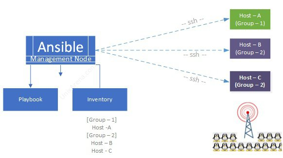

## It's all about Automation!

- Managing LARGE infrastructures is HARD!
	- imagine having 100s of servers! that you need to configure!
	- imagine you DONT know what's inside evey server! 
	- Hay it works here but not there BUT WHYY!!!!
		- someone added this dark package in server number 32 and 80 but it isnt anywhere else! 
		- **WHAT CAN WE DOOOO AAAAAAAAAAAAAAAAAAa!!**
		
	- BASH SCRIPTS EVERYWHERE! 
		- **Idempotency** : running the program multiple times and have it produice the same result
			 - https://docs.ansible.com/ansible/latest/playbook_guide/playbooks_intro.html#desired-state-and-idempotency
		 - example `mkdir example`
			 - if we want that command to be idempotent `mkdir -p example` which means if the example exist well nothing will be done! 
			 - With ansible, idempotency is backed in, sooooo no zillion if statment in your shell script and more easier readability and therefore maintainability!
			 - Manual approaches to managing IT infrastructure, such as using scripts or SSH, can be time-consuming, error-prone, and difficult to scale. These methods also lack the ability to enforce standardized processes and configurations, making it challenging to maintain a consistent and secure environment.

### ==> Automation tools are here for that!!

- Automation tools provide a way to automate repetitive, time-consuming tasks such as 
	- server provisioning,
	- configuration management,
	- software deployments, and monitoring. 
	- Automation tools can help ensure consistency and reliability in IT operations. By using automation to enforce standardized processes and configurations, IT teams can minimize errors and reduce the risk of downtime and security breaches.
	


## What is ansible?

Ansible is an 
- Open source, IT automation software application written in Python. 
- It can 
	- configure systems,
	- deploy software, 
	- and orchestrate advanced workflows to support application deployment, system updates, and more.

Ansible’s main strengths are :
- simplicity and ease of use. 
- It also has a strong focus on security and reliability, featuring minimal moving parts. It uses OpenSSH for transport 
- Uses a human-readable language that is designed for getting started quickly without a lot of training.

---

## Getting started:

### Ansible architecture

- Where to install ansible? in the host? on the server machines?? WHERE??
	- You only need it in the control host (or whatever it's called! (the workstation in the first image below))
	- It connects and does it's magic using ssh, it doesn't need anything else!




---

### Installation 

You only need to install it on the Management node machine!
- Using Python pip 
	1. Using pip (check if pip is available)
		- ensure pip is availible https://docs.ansible.com/ansible/latest/installation_guide/intro_installation.html#ensuring-pip-is-available
		- then install: `python3 -m pip install --user ansible`
			 
	2. On [specific operationg System](https://docs.ansible.com/ansible/latest/installation_guide/installation_distros.html#installing-ansible-on-specific-operating-systems)
		- WinDows... CANNOT RUN only Manage Windows hosts! but you can use WSL https://docs.ansible.com/ansible/latest/os_guide/windows_faq.html#can-ansible-run-on-windows
		- Fedora
			 - `sudo dnf install ansible`
		- Ubuntu: (using Ppa)
		```bash
		sudo apt update
		sudo apt install software-properties-common
		sudo add-apt-repository --yes --update ppa:ansible/ansible
		sudo apt install ansible
		```

### Keywords
- Modules
- roles
- tags
- Ansible playbooks
- plays
- tasks
- hosts
- inventory
- Conditions
- handlers


### Basic SSH!

Since Ansible uses ssh to connect into a remote server. We need to know a little bit about ssh so.

1. Connect through ssh with terminal
```bash
 ssh user@ipaddress
 ssh goku@192.168.122.165
 ssh 192.168.122.165
```
2. check your `~/.ssh/known_hosts` file!
3. Create ansible specific key (apparently it's safer!)
```bash
ssh-keygen -t ed25519 -C "write a comment here"
```
- `-t`: specifying the key type
- `-C`: comment
- `-f`: if you want to specify the filepath(and name) 
```bash
ssh-keygen -t ed25519 -f  ~/.ssh/ansible2 -C "this is a comment"
```

4. add ssh key into a server!
```bash
ssh-copy-id -i path/to/key.pub ipadress
ssh-copy-id -i ~/.ssh/ansible.pub 123.123.123.123
```
5. check `~/.ssh/autorized_keys`

- **Fedora Workstation**
	- https://www.linuxcapable.com/how-to-install-and-enable-ssh-on-fedora-linux/
	- https://linuxconfig.org/how-to-install-start-and-connect-to-ssh-server-on-fedora-linux
	- you need to enable and start sshd
	- `sudo ss -lt` : check open ports? i think

## Running Ah-Hoc Commands

- https://docs.ansible.com/ansible/latest/command_guide/cheatsheet.html#ansible-cli-cheatsheet
- Now that we connected throuh ssh and granted ourself the permissions to connect to the server let's run some basic commands:

```shell
ansible all --key-file ~/.ssh/ansible -i inventory -m ping
ansible rocky_servers --key-file -i inventory -m ping
```

### Inventory!

The inventory is simply a file where we define all our servers and cloud instances that Ansible will manage
- How to create it ?
	- We just create a file and put the IP adress for example :
```shell
[ubuntu_servers]
192.168.122.165
192.168.122.116
[rocky_servers]
192.168.122.153
```
or witout any specifications 
```shell
192.168.122.165
192.168.122.116
192.168.122.153
```

- Ansible supports several ways to have inventories: https://docs.ansible.com/ansible/latest/inventory_guide/intro_inventory.html#how-to-build-your-inventory


### cfg file

Is a file in which you can define some configuration such as the path to the ssh key, the `remote_username` that ansible will use to connect to the servers
the path to the inventory file, and many other things..
- https://docs.ansible.com/ansible/latest/reference_appendices/config.html#ansible-configuration-settings
- NAME IT `ansible.cfg`:  that's how ansible does it.

- example of a config file
```rust
[defaults]
inventory = inventory
private_key_file = ~/.ssh/ansible
remote_user = goku
```

- **Let's run our previous command now**
```shell
ansible all --key-file ~/.ssh/ansible -i inventory -m ping
ansible all -m ping
```

- List all  your adresses
```bash
ansible all --list-hosts
ansible ubuntu_servers --list-all # specify category
```

- Get a ton of informations about the servers!
```bash
ansible all -m gather_facts
ansible all -m gather_facts --limit 192.168.122.153 
ansible localhost -m gather_facts # localhost facts!
```

- Update servers
```bash
ansible all -m apt -a update_cache=true --become --ask-become-pass
```
 this is the equivalent of doit `sudo apt update` 
- `-m` apt : use the apt module (package manager)
- `-a` argument for the apt , which in this case means update the cache 
- `--become` or `-b` :  allow us to run it with root privileges (sudo)
- `--ask-become-pass` or `-K` allow us to prompt the request for the password


### Modules

- https://docs.ansible.com/ansible/latest/plugins/module.html#modules

In Ansible, Modules are small pieces of code that perform specific tasks on the managed servers. Modules can be used to perform a wide range of tasks, including file manipulation, package installation, service management, user management, and more.
For example the module `ping`
- Ping yourself:
	- `ansible localhost -m ping`

- the **apt** module is used for installing packages! or updating them  for example
- Ansible ships with A LOT of modules , but you can also create your own modules or use community built ones ( check ansible galaxy)

#### Arguments

Modules take arguments for example :
- `ansible all -m apt -a update_cache=true`
- udate_cache is an argument! which takes the value true


## Playbooks

- PLAYBOOK
	- PLAY
		- Tasks

- In Ansible, playbooks are YAML files that define the tasks to be performed on the managed servers. 
- Playbooks provide a way to define the automation workflows that Ansible will execute, using a simple, human-readable syntax.
- Each playbook consists of one or more **plays** which define a set of tasks to be performed on a specific set of servers. Each task in a play maps to an Ansible module, which performs a specific action on the managed servers.

- **Plays** provide a way to organize tasks and modules into logical groups, based on the servers or groups of servers they target. 
	- For example, a playbook might have a play that installs and configures web servers, and another play that sets up database servers.

A play consists of (generally!):

```yaml
- name: (optional, but recommended)
  hosts:
  tasks:
```
- update and upgrade (autoremove for removing unused packages)
```yaml
- name: Update and upgrade packages on Debian/Ubuntu servers
  hosts: my_servers
  become: true
  tasks:
    - name: Update package cache
      apt:
        update_cache: yes

    - name: Upgrade packages
      apt:
        upgrade: yes
        autoremove: yes
        
```
- example of a playbook installing appache2 and update !
```yaml
- hosts: all
  become: true
  tasks:

  - name: update repository index
    apt:
      update_cache: yes

  - name: install apache2 package
    apt:
      name: apache2
      state: latest

  - name: add php support for apache
    apt:
      name: libapache2-mod-php
      state: latest
```
- uninstall appache
```yaml
- hosts: all
  become: true
  tasks:
  - name: install apache2 package
    apt:
      name: apache2
      state: absent

  - name: add php support for apache
    apt:
      name: libapache2-mod-php
      state: latest
```
- Another example for fedora!
```yaml
 - name: setup Fedora my own way! (this is a play!)
  hosts: localhost
  connection: local
  become: true

  pre_tasks:
  - name: Enable the RPM Fusion repository
    dnf:
      name: "https://download1.rpmfusion.org/free/fedora/rpmfusion-free-release-{{ansible_distribution_major_version}}.noarch.rpm"
      state: present
    when: ansible_distribution == 'Fedora'

  - name : update and upgrade packages!

  tasks:
  - name: install packages
    package:
      name:
        - htop
        - tmux
        - vim
        - neovim
        - flatpak
 - name: setup Ubuntu (this is another play)
  hosts: ubuntu_servers
  become: true
  tasks:
  - name: update repository index
    apt:
      update_cache: yes
```

- Running playbook 
	- `ansible-playbook --ask-become-pass your_playbook.yml`
	- `ansible-playbook -K your_playbook.yml`


#### "when"
https://docs.ansible.com/ansible/latest/playbook_guide/playbooks_conditionals.html#basic-conditionals-with-when

```yaml
 - name: setup Fedora my own way! (this is a play!)
  hosts: localhost
  connection: local
  become: true

  tasks:
  - name: Enable the RPM Fusion repository
    dnf:
      name: "https://download1.rpmfusion.org/free/fedora/rpmfusion-free-release-{{ansible_distribution_major_version}}.noarch.rpm"
      state: present
    when: ansible_distribution == 'Fedora'
```
- `when: ansible_facts['os_family'] == "Debian"`

we can get the ansible distribution with the **gather facts!** command

#### "tags"

- only run plays and tasks tagged with these values
- you can have one or more tags

- example of tags: 
```yaml
 - name: update rpm repo
  hosts: localhost
  connection: local
  become: true

  tasks:
  - name: Enable the RPM Fusion repository
	tags : always
    dnf:
      name: "https://download1.rpmfusion.org/free/fedora/rpmfusion-free-release-{{ansible_distribution_major_version}}.noarch.rpm"
      state: present
    when: ansible_distribution == 'Fedora'
   - name : update
     tags : always
     dnf:
       update_cache: yes   
```
- to run tasks of specific tags
	- `ansible-playbook --ask-become-pass -t tagname your_playbook.yml`

- Copy files : 
```rust
- name : copy some file
tags: html, soydev
copy:
  src: your/file/path/local
  dest: where/to/put/it/in/server
  owner: goku
  group: goku
  mode : 0664
```

- Unarchive (and download for DA internet!)
```rust
name : download uprchive and all the good things!
tags: html, soydev
unarchive:
  src: https://releases.hashicorp.com/terraform/1.3.9/terraform_1.3.9_linux_amd64.zip
  dest: /usr/local/bin/
  remote_src: yes
  mode : 0755
  owner: root
  group: root

```

- Services :
```rust
- name: install the appache and php
  hosts: rocky_servers
  become : true
  tasks:

  - name: install apache2 package
    dnf:
      name: 
        - php
        - httpd
  #    state: absent
  - name: start httpd service
    service:
      name: httpd
      state: started
```

- Add users!
	- check `/etc/passwd` before and after
```rust
- name: add user
  hosts: all
  become : true
  tasks:

  - name: create a new user (named klibsou )
	user:
	  name: klibsou
	  groups: root
	  
```

- https://docs.ansible.com/ansible/latest/collections/ansible/builtin/user_module.html 
```rust
- name: delete user
  hosts: fedora_workstation 
  become : true
  tasks:

  - name: delete  user (named klibsou )
    user:
      name: klibsou
      groups: root
      state: absent
      remove: true
```

## Roles

- https://docs.ansible.com/ansible/latest/playbook_guide/playbooks_reuse_roles.html#roles

In Ansible, roles are a way to 
- organize and reuse playbooks, by grouping related tasks, variables, and files into a self-contained unit. 
- A role is essentially a directory structure that contains all of the resources needed to perform a specific task or set of tasks.

- Roles provide a way to break down complex playbooks into 
	- smaller
	- more manageable components
	making it easier to share and reuse automation code across different projects and teams. They also promote modularity and maintainability, since each role can be developed and tested independently of the rest of the playbook.

So let's take do that!

1. Create the directory name `roles`
2. every sub directory is a role
3. inside a role directory you NEED to have one of these folders
	1. tasks
	2. handlers
	3. library
	4. defaults
	5. vars
	6. files
	7. templates
	8. meta
	 - Another way to say it 
		 - "An Ansible role has a defined directory structure with eight main standard directories. You must include at least one of these directories in each role. You can omit any directories the role does not use."

- example!
- IM lazy let's just use the example of this guy and one by chatGpt 

```
myproject/
├── playbook.yml
└── roles
    └── myrole
        ├── tasks
           └── main.yml
```

- `playbook.yml`
```yaml
- name: Configure myserver   
  hosts: myserver   
  become: true    
  roles: 
    - myrole
```

---
backround_image source : "https://pantheon.tech/wp-content/uploads/2019/04/ansible.png"

